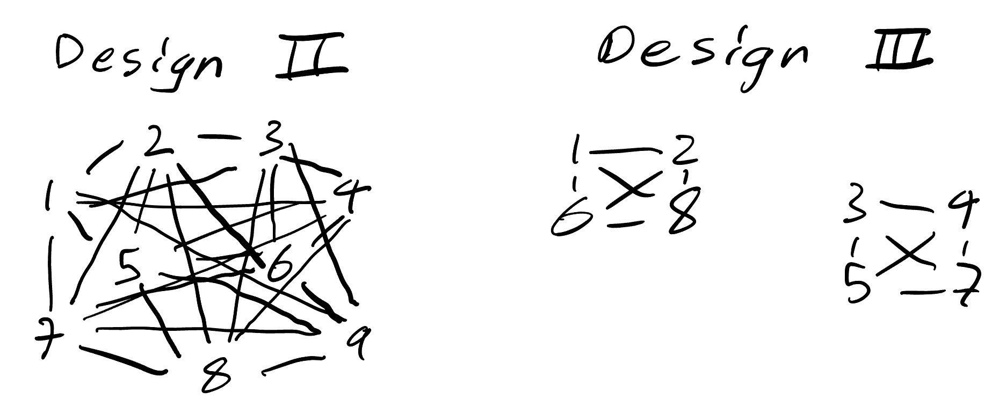

```{r echo=F}
library(knitr)
knitr::opts_chunk$set(fig.width=4, fig.height=3, message=F, warning=F, collapse=T)
options(scipen=6, digits=7)
options(show.signif.stars = FALSE) # Show no stars for significance tests
```


## Q1
#### a)




Design II is connected but Design III is not.

#### b)

For Design II, $\tau_1-\tau_5$ is estimable because there is a direct connection between treatment 1 and 5. $\tau_1-\tau_6$ is also estimable indirectly. For Design III, $\tau_1-\tau_6$ since they are connected but not $\tau_1-\tau_5$.

## Q2
#### a)

Bonferroni: $\hat{C} \pm t_{\alpha/2/m,\text{df MSE}} \times \text{SE}(\hat{\text{C}})$

$\hat{C_1}=-4.125-(-8.125)=4$

$\text{SE}(\hat{C})=\sqrt{\text{MSE}\times(\frac{2k}{\lambda g})}$


```{r}
mse <- 44.155
se <- sqrt(mse*((2*5)/(4*6)))
var <- qt(0.02/2/2,df = 19, lower.tail = F) * se

c(4-var,4+var)
```


$\hat{C_2}=-18.875-(-11.375)=-7.5$

```{r}
mse <- 44.155
se <- sqrt(mse*((2*5)/(4*6)))
var <- qt(0.02/2/2,df = 19, lower.tail = F) * se

c(-7.5-var,-7.5+var)
```


For the first CI, we can conclude that the effect on pulse rate of changing step frequency from 28 steps per minute to 14 at a step height of 5.75in is between -8.271348 and 16.271348 bpm. For the second CI, we can conclude that the effect on pulse rate of changing step frequency from 28 steps per minute to 14 at a step height of 11.5in is between -19.771348 and 4.771348 bpm. Since 0 falls within both CIs, we cannot say if there is an effect. 

#### b)

$\hat{C} = 18.875-2*12.375+(-11.375) = -17.25$

```{r}
est <- -17.25; est
se <- sqrt(mse*((2*5)/(4*6))); se

tstat <- est/se; tstat
df <- 19; df
2*pt(tstat,df)
```


Since p<0.05, we can reject the null that the contrast is zero i.e. we can conclude that heart rate increases linearly with step frequency.

## Q3
```{r}
abrasive = read.table("http://www.stat.uchicago.edu/~yibi/s222/abrasive.wear.txt", h=T)
```

#### a)

$C_B = -y_{111}-y_{112}+y_{121}+y_{122}-y_{211}-y_{212}+y_{221}+y_{222}$

$\hat{C}_B=-0.049-0.041 +0.220 +0.358- 0.044 -0.030 +0.133+ 0.192 = 0.739$


$c^{AC}_{ijk} = c^{A}_{ijk} c^{C}_{ijk} \Rightarrow$

$\hat{C}_{AC}= y_{111}-y_{112}+y_{121}-y_{122}-y_{211}+y_{212}-y_{221}+y_{222}= 0.049-0.041 +0.220 -0.358- 0.044 +0.030 -0.133+ 0.192 = -0.085$

#### b)

```{r}
library(daewr)
```

```{r}
abrasive$A = as.factor(abrasive$A)
abrasive$B = as.factor(abrasive$B)
abrasive$C = as.factor(abrasive$C)
contrasts(abrasive$A) = contr.sum(2)
contrasts(abrasive$B) = contr.sum(2)
contrasts(abrasive$C) = contr.sum(2)
lm1 = lm(y ~ A*B*C, data=abrasive)
lm1$coef[-1]
```

```{r}
halfnorm(lm1$coef[-1], alpha=0.05)
```


```{r}
halfnorm(lm1$coef[-1], alpha=0.2)
```


At a significance level of 0.05, we do not find any of the effects to be significantly different than zero. Once we increase the level to 0.2, we find that B is significant, meaning that the B main effect could be nonzero. 
